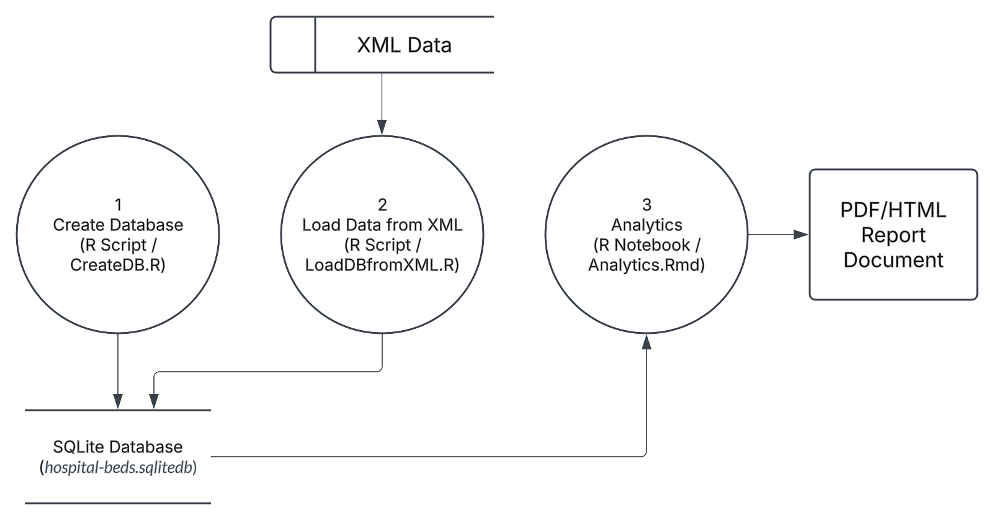
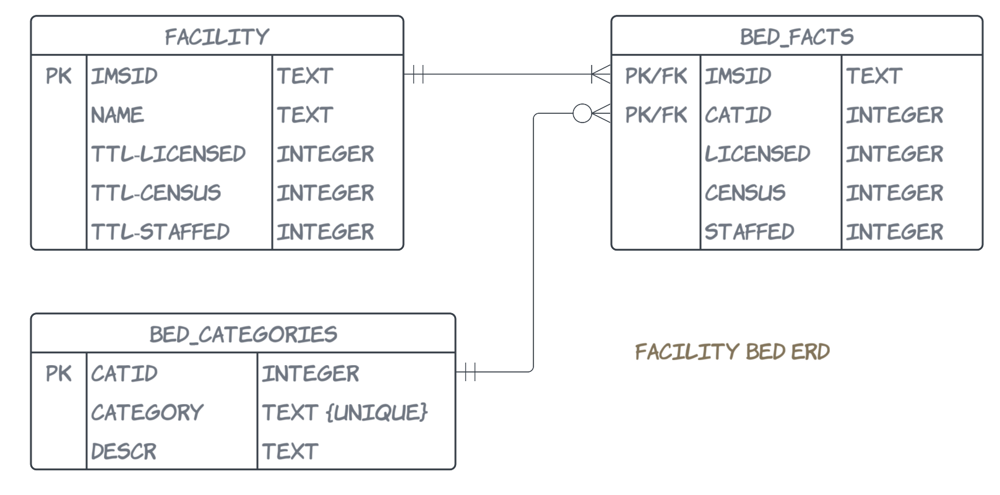

# ICU Staffing 
**Course:** _DA5020 - Collecting, Storing, and Analyzing Data_

## Overview
This project simulates a real-world healthcare analytics scenario where Integrated Health Anallytics Services LLP (IHAS) is contracted by Parplex, an Integrated Delivery System (IDS). Leadership at Parplex is evaluating whether to hire additional nurses in their hospital network, with a focus on ICU and SICU units.

The goal of this project is to analyze hospital bed data, determine which facilities have sufficient ICU/SICU volume, and recommend potential pilot sites for staffing interventions. The data has been stored in a relational database and can be queried using SQL.

## Scenario
You are a Data Analyst in the Business Insights Group at IHAS. Parplex is considering hiring additional nurses, particularly for hospitals with ICU and SICU units, to improve patient care. Research shows that higher nurse-to-patient ratios lead to better outcomes in these intensive care settings.

However, expanding staffing is only cost-effective at hospitals with sufficient ICU/SICU bed volume. Parplex defines bed capacity by three types:

* **Licensed beds** - total beds allowed by state license
* **Census beds** - total beds at the facility
* **Staffed beds** - total beds for which staffing (physicians and nurses) exists

The goal is to identify 1–2 pilot sites for staffing interventions in the next fiscal quarter. Data is provided in XML format and must be converted into a relational database for query and reporting purposes.

## Data Pipeline and Workflow
The data flow diagram below illustrates the workflow.

* `CreateDB.R` - Creates a new SQLite database(`hopital-beds.sqlitedb`) with the necessary tables to store the XML data.
* `LoadDB.R` - Parses the XML data, extracts the information, and inserts it into correct tables in the database.
    * The schema is shown in the entity-relationship diagram below:
    
        * `bed_categories` is a lookup table
        * `ttl-licensed` in the `facility` table refers to total licensed beds for a facility, while `ttl-licensed` in `Bed_Facts` refers to licensed beds by type for each facility. 
* `Analytics.Rmd` - Performs analytics on the data and generates a knitted HTML report for leadership.

## Files
* `CreateDB.R`
* `LoadDB.R`
* `Analytics.Rmd`
* `AnalyticsReport.html`
    * [Rendered report](https://zoechow24.github.io/icu-staffing/AnalyticsReport.html)

## Tools & Skills
* R
* HTML
* SQL
* Data extraction & wrangling 
* Data aggregation
* Data visualization

## Methodology
1. Run `CreateDB.R`
2. Run `LoadDB.R`
3. Run/knit `Analytics.Rmd`

## Results
The [final report](https://zoechow24.github.io/icu-staffing/AnalyticsReport.html) an analysis of the data provided, including the facilites, licensed beds, staffed beds, and categories. Polished graphs and tables are provided.
